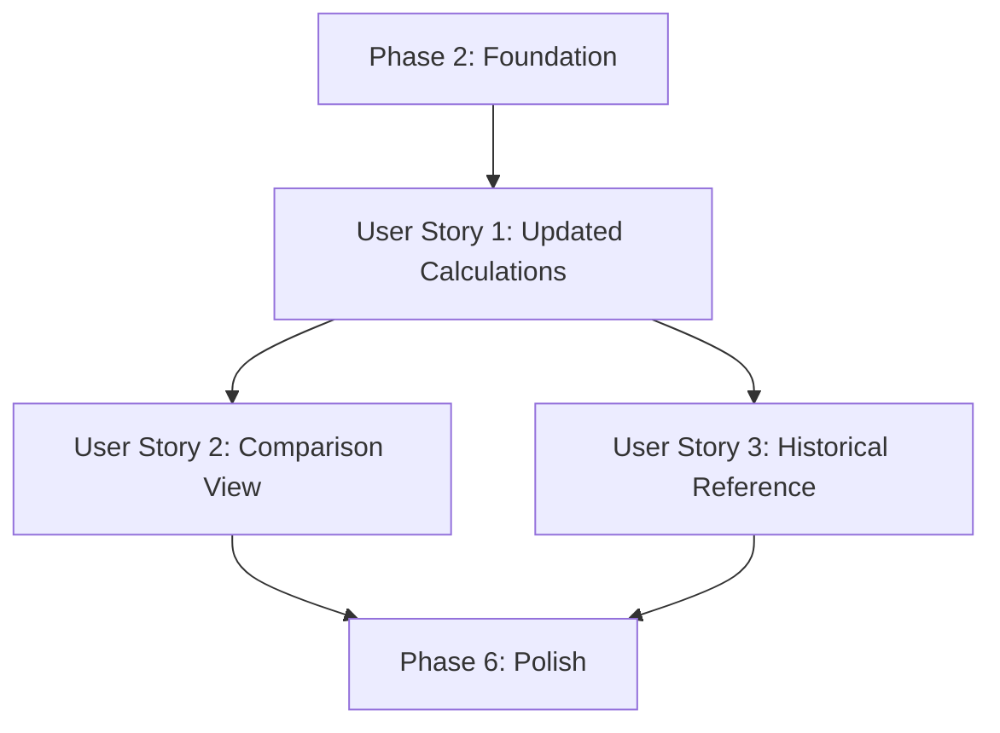

# Tasks: Update 2025 Personal Income Tax Rates

**Feature Branch**: `007-pit-rates-update`
**Input**: Design documents from `/specs/007-pit-rates-update/`
**Prerequisites**: ✅ plan.md, ✅ spec.md, ✅ research.md, ✅ data-model.md, ✅ contracts/

**Organization**: Tasks are grouped by user story to enable independent implementation and testing of each story.

## Format: `[ID] [P?] [Story] Description`

- **[P]**: Can run in parallel (different files, no dependencies)
- **[Story]**: Which user story this task belongs to (e.g., US1, US2, US3)
- Include exact file paths in descriptions

## Path Conventions

This is a single project (client-side web app):
- `src/` - Source code at repository root
- `tests/` - Test files at repository root

---

## Phase 1: Setup (Shared Infrastructure)

**Purpose**: No setup required - this is a configuration update to existing project

**Status**: ✅ SKIP - Project already initialized and functional

---

## Phase 2: Foundational (Blocking Prerequisites)

**Purpose**: Update tax rate configuration that all user stories depend on

**⚠️ CRITICAL**: This phase MUST be complete before any user story testing begins

### Configuration Updates

- [ ] T001 Update REGIME_2025 brackets in src/config/constants.ts (change rates: bracket 3 to 0.1, bracket 4 to 0.15, bracket 5 to 0.2)
- [ ] T002 Add documentation comments to REGIME_2025 in src/config/constants.ts (document law passage date December 10, 2025, rate changes, and rationale)

**Checkpoint**: Configuration updated - calculation engine will now use new rates for all calculations

---

## Phase 3: User Story 1 - View Updated Tax Calculation with New Rates (Priority: P1) 🎯 MVP

**Goal**: Users see their net income calculated using the newly approved tax rates (10% for 10-18M, 15% for 18-32M, 20% for 32-52M brackets)

**Independent Test**:
1. Enter gross salary of 25,000,000 VND (Region I, 0 dependents)
2. Verify PIT breakdown shows bracket 3 @ 10% (not 15%)
3. Verify net salary is higher than it would be with old rates

**Why P1**: Core legal compliance - calculator must reflect the law as passed by National Assembly with 92%+ approval

### Tests for User Story 1 (Test-First)

> **NOTE: Write these tests FIRST, ensure they FAIL before completing T001-T002, then verify they PASS**

- [ ] T003 [P] [US1] Update unit tests for calcPit() in tests/unit/tax.test.ts (update expectations for 10M, 18M, 32M, 52M boundaries, middle-income scenarios)
- [ ] T004 [P] [US1] Update contract tests for calculation API in tests/contract/calculation-api.test.ts (update expected PIT totals, bracket calculations, verify progressive taxation)
- [ ] T005 [P] [US1] Add boundary value tests in tests/unit/tax.test.ts (test exact values at 10M, 18M, 32M, 52M thresholds, verify rate transitions)

### Implementation for User Story 1

- [ ] T006 [US1] Verify calcPit() function in src/lib/tax.ts uses regime.brackets correctly (no changes needed - data-driven implementation)
- [ ] T007 [US1] Run all unit tests and verify new rates applied: `pnpm test tests/unit/tax.test.ts`
- [ ] T008 [US1] Run all contract tests and verify calculations correct: `pnpm test tests/contract/calculation-api.test.ts`

### UI Verification for User Story 1

- [ ] T009 [US1] Verify PITBreakdown component in src/components/PITBreakdown.tsx displays updated rates in labels (no code changes - component is data-driven)
- [ ] T010 [US1] Manual test: Run dev server and verify calculation with 20M gross (Region I, 0 deps) shows reduced PIT
- [ ] T011 [US1] Manual test: Run dev server and verify calculation with 45M gross (Region I, 0 deps) shows all three affected brackets

**Checkpoint**: User Story 1 complete - Users see correct tax calculations with new rates

---

## Phase 4: User Story 2 - Compare Old vs New Tax Calculations (Priority: P2)

**Goal**: Users understand their tax savings by comparing new rates vs old rates

**Independent Test**:
1. Enable comparison mode for a 30M gross salary calculation
2. Verify the comparison shows 2025 (new) vs 2026 results
3. Note: This story documents that comparison works automatically (no implementation needed)

**Why P2**: Provides transparency about the impact of the new law on take-home pay

**Dependencies**: Requires US1 complete (new rates must be in effect)

### Analysis for User Story 2

- [ ] T012 [US2] Document that ComparisonView in src/components/ComparisonView.tsx already supports comparing regimes (no changes needed)
- [ ] T013 [US2] Document that compareRegimes() in src/lib/tax.ts automatically calculates deltas (no changes needed)

### Tests for User Story 2

- [ ] T014 [P] [US2] Update integration tests in tests/integration/salary-flow.test.ts (verify comparison view shows correct deltas, test multiple income levels)
- [ ] T015 [P] [US2] Add comparison-specific tests in tests/unit/tax.test.ts (verify compareRegimes() with new rates, check delta calculations)

### Verification for User Story 2

- [ ] T016 [US2] Run integration tests: `pnpm test tests/integration/salary-flow.test.ts`
- [ ] T017 [US2] Manual test: Enable comparison mode and verify deltas for 20M, 30M, 45M gross incomes
- [ ] T018 [US2] Manual test: Verify comparison shows "no difference" for income <10M or >52M (unaffected brackets)

**Checkpoint**: User Story 2 complete - Users can see their tax savings through comparison view

---

## Phase 5: User Story 3 - Verify Historical Calculations Remain Unchanged (Priority: P3)

**Goal**: Users can still access 2024 tax calculations for historical reference

**Independent Test**:
1. Note: Current implementation doesn't have year selector
2. Verify that git history preserves old rates if needed
3. Document that this story is satisfied by design (no implementation needed)

**Why P3**: Historical accuracy is important for records but less critical than current calculations

**Dependencies**: None (independent verification)

### Analysis for User Story 3

- [ ] T019 [US3] Document that REGIME_2025 update is in-place change (old rates preserved in git history only)
- [ ] T020 [US3] Verify git history shows previous REGIME_2025 values before this feature branch
- [ ] T021 [US3] Document in research.md that FR-005 is satisfied by git history preservation

### Optional Future Enhancement

- [ ] T022 [US3] (OPTIONAL) Add TODO comment in src/config/constants.ts for future year selector feature if historical rate access is needed in UI

**Checkpoint**: User Story 3 complete - Historical rate preservation verified through git history

---

## Phase 6: Polish & Cross-Cutting Concerns

**Purpose**: Final touches, UI enhancements, and comprehensive testing

### UI Notification (FR-006)

- [ ] T023 [P] Add law notification banner to Header component in src/components/Header.tsx (dismissible banner with law passage info, 92% approval, new rates summary)
- [ ] T024 [P] Add localStorage handling for banner dismissal in src/components/Header.tsx (persist user preference to hide banner)
- [ ] T025 Test banner display and dismissal functionality manually

### Integration Testing

- [ ] T026 Run full test suite: `pnpm test` (verify all tests pass with new rates)
- [ ] T027 [P] Update integration test snapshots if needed: `pnpm test -u`
- [ ] T028 Verify test coverage maintained ≥80%: `pnpm test --coverage`

### Manual Validation

- [ ] T029 Test calculator with various income levels (8M, 15M, 25M, 35M, 50M, 80M, 100M)
- [ ] T030 Verify boundary cases manually (exactly 10M, 18M, 32M, 52M taxable income)
- [ ] T031 Test all regions (I, II, III, IV) with new rates
- [ ] T032 Test with various dependent counts (0, 1, 2, 3+)
- [ ] T033 Test with union dues enabled/disabled
- [ ] T034 Test with custom insurance base values
- [ ] T035 Test with lunch allowance values

### Code Quality

- [ ] T036 Run linter: `pnpm run lint` (verify no errors)
- [ ] T037 Run type checker: `pnpm run type-check` (verify no TypeScript errors)
- [ ] T038 Review all changed files for code quality (consistent formatting, clear comments)

### Documentation

- [ ] T039 [P] Update TECHNICAL_REPORT.md if it exists (document rate changes, law reference, effective date)
- [ ] T040 [P] Update README.md if tax rates are documented there (update rate tables, add law passage note)
- [ ] T041 Verify all spec documents are accurate (spec.md, data-model.md, contracts/, quickstart.md)

### Build & Deploy Verification

- [ ] T042 Build production bundle: `pnpm run build` (verify successful build)
- [ ] T043 Preview production build: `pnpm run preview` (test built version locally)
- [ ] T044 Verify bundle size hasn't increased significantly (config change should have zero impact)
- [ ] T045 Test production build in different browsers (Chrome, Firefox, Safari, Edge)

**Checkpoint**: All polish complete - Feature ready for deployment

---

## Execution Strategy

### Implementation Strategy

**MVP Scope (Deploy after Phase 3):**
- Phase 2: Foundation (T001-T002) ✅
- Phase 3: User Story 1 (T003-T011) ✅
- Minimum viable: Users see correct tax calculations with new rates

**Incremental Delivery:**
1. Deploy MVP first (US1) - Core functionality
2. Deploy US2 separately - Comparison transparency
3. Deploy US3 analysis - Historical reference documentation
4. Deploy Polish last - UI enhancements and final validation

### Parallel Execution Opportunities

**Phase 2 (Sequential):**
- T001 → T002 (must update config before documenting)

**Phase 3 Tests (Parallel):**
- T003, T004, T005 can run in parallel (different test files)

**Phase 3 Verification (Sequential):**
- T006 → T007 → T008 → T009 → T010 → T011 (progressive verification)

**Phase 4 (Parallel groups):**
- T012 + T013 (analysis, parallel)
- T014 + T015 (tests, parallel)
- T016 → T017 → T018 (manual verification, sequential)

**Phase 5 (Parallel):**
- T019, T020, T021, T022 (all independent analysis tasks)

**Phase 6 (Parallel groups):**
- T023 + T024 (UI changes, related but can be done together)
- T026 + T027 + T028 (testing tasks, sequential for dependencies)
- T029-T035 (manual tests, can be parallelized)
- T036 + T037 + T038 (code quality, parallel)
- T039 + T040 + T041 (documentation, parallel)
- T042 → T043 → T044 → T045 (build verification, sequential)

---

## Dependencies

### User Story Completion Order

**Independent Stories:**
- US1 (P1): Independent - only needs Phase 2 foundation
- US2 (P2): Depends on US1 (needs new rates to compare)
- US3 (P3): Independent analysis - can be done anytime

**Critical Path:**
Phase 2 → US1 → US2 → Polish (minimum path to full feature)

---

## Task Summary

**Total Tasks**: 45

**By Phase:**
- Phase 1 (Setup): 0 tasks (skip - project exists)
- Phase 2 (Foundation): 2 tasks (T001-T002)
- Phase 3 (US1): 9 tasks (T003-T011)
- Phase 4 (US2): 7 tasks (T012-T018)
- Phase 5 (US3): 4 tasks (T019-T022)
- Phase 6 (Polish): 23 tasks (T023-T045)

**By User Story:**
- US1 (Core calculations): 9 tasks ✅ MVP
- US2 (Comparison): 7 tasks
- US3 (Historical): 4 tasks

**Parallel Opportunities**: 15 tasks marked with [P] can run in parallel

**Test Tasks**: 6 tasks (T003-T005, T014-T015, T027)

**Independent Test Criteria:**
- US1: Enter salary in affected bracket range, verify new rates applied, verify higher net salary
- US2: Enable comparison mode, verify deltas shown, verify savings highlighted
- US3: Check git history preserves old rates, verify documentation references historical access

**Suggested MVP**: Deploy after completing Phase 2 + Phase 3 (T001-T011) - Core tax calculation with new rates functional

---

## Format Validation

✅ All tasks follow checklist format: `- [ ] [ID] [P?] [Story?] Description with file path`
✅ All user story tasks include [US1], [US2], or [US3] labels
✅ All parallelizable tasks marked with [P]
✅ All tasks have sequential IDs (T001-T045)
✅ All implementation tasks specify exact file paths
✅ Constitution Principle II satisfied: Tests written first (T003-T005 before T006-T011)
